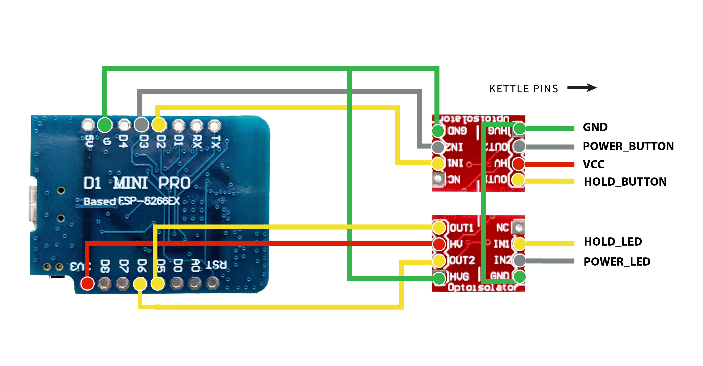
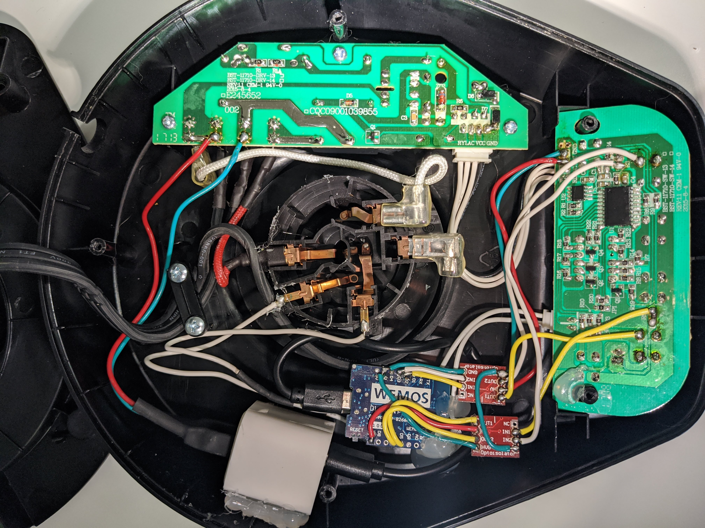

# Bonafizy

A project enabling control of Bonavita variable temperature kettles remotely over wifi. It adds an ESP8266 based wifi stack that runs a bit of C code to expose an HTTP REST API endpoint.

There's support to control both power and hold buttons individually as well as read the power or hold LED status. Bonafizy responds back with a JSON body making it easy to parse the output.

```
$ curl kettle.local/brew
{"message": "Brewing now!!!", "state": {"power": 1, "hold": 1}}
```

```
$ curl kettle.local/state
{"version": "0.1.2_mdns", "state": {"power": 0, "hold": 0}}
```

The name bonafizy is a portmanteau of Bonavita, WiFi and lazy. And by lazy I mean smart and resourceful :)

## Features
* Existent buttons continue to function
* Control both POWER and HOLD individually
* Read both POWER and HOLD LED state
* mDNS
* TBD
  * Wifi config during initial setup

## Parts list
* [Bonavita kettle](https://bonavitaworld.com/products/category/Kettles) (of course). - 1
* [Wemos D1 Mini](https://www.aliexpress.com/item/32529101036.html) - 1
* [SparkFun Opto-isolator Breakout](https://www.sparkfun.com/products/9118) - 2
* USB wall charger - 1
## Tools and consumables
* Jumper wires - few, ideally in different colours
* Micro usb cable
* Heatshrink tubing
* Hot glue gun
* Soldering iron, solder, flux, wire snips yada yada yada...

## Wiring Diagram



## Notes
First and foremost be extremely careful, there is mains supply open and accessible inside the kettle base. Do not open it if you are not comfortable and wary about operating around mains voltage. This can badly injure, maim or kill you. Highly suggest not plugging the kettle in with the base cover off to avoid getting electrocuted.
Now that the warning is out of the way, onto business...

The kettle's logic is reversed, which means pulling a pin low is considered as on. Don't know why, though it is mildly annoying. Secondly, the PCB has a very thorough conformal coating all over it which makes probing or soldering anything a pain. You can scrape this coating off with a xacto knife or acetone, I just hard balled it with the soldering iron :P

Solder the D1 mini and opto coupler boards together per the wiring diagram. For the wires going to the kettle's PCB solder on about 8~10 inch long pieces onto the opto coupler boards. 

Flash the the sketch to the board as things will get more in situ after this. Arduino IDE with the ESP8266 board files added to it works well. Add the wifi credentials where it says 
```
WIFI_SSID 
WIFI_PASSWORD
```
Now is a good time to test the API endpoint is responding. Toggling the LED pins by pulling them high/low should reflect on the /state endpoint.

Loosely place everything in the base and wire/route things however it seems appropriate. Solder the wires to the specific pins on the kettle (remember - conformal coating).

Solder two wires to the power pins of the USB charger and heatshrink them in place, making sure no bits are exposed. Next place the USB charger in the base and try to put the cover back on to check placement and fitment. Once content, hot glue the charger in place. Connect charger to D1 mini board with the USB cable. Solder the other ends of the wire to the power board on the kettle.

At this point things should be at a place to test functioning of the whole setup. Tighten a couple of screws to hold the base in place, the center socket that the kettle sits on tends to come loose so locate it correctly before tightening the screws. Easiest way to test is using the `test_endpoints.sh` script.

If everything is good. Undo the screws and coat all the points that were soldered on the kettle PCBs as well as the D1 mini board and the opto coupler boards with conformal coat/lacquer/nailpaint. Tighten up all the screws again. Run tests one more time and you should be good to go.



## Endpoints
```
/state      - retrieve kettle state
/brew       - turn power and hold on at once
/power/off  - turn kettle off
/power/on   - power on
/hold/off   - switch hold off
/hold/on    - invert ^
```

## Musings
* Works for sure with BV382510V, quite likely will work with other variable temperature ones listed at http://bonavitaworld.com/product-categories/kettles.
* The ILD213T opto coupler [datasheet](https://www.vishay.com/docs/83647/ild205t.pdf)
* Smallest USB charger you can find. The Apple 5w charger from olden days barely fits in there, takes some cutting of the base. An [HLK-PM01](https://www.aliexpress.com/wholesale?catId=0&initiative_id=SB_20200329071832&SearchText=hlk+pm01) is another potentially good candidate though not tested personally.
* Kettle originally contains an ATMEL 24C02 EEPROM and a SONIX SN8P2722 microcontroller.


